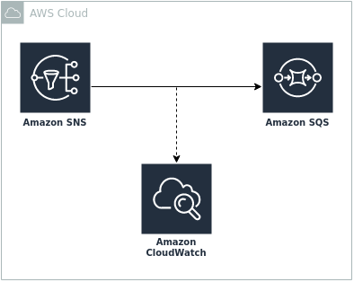

# aws-sns-sqs-monitoring

Example project to activate monitoring for sns via a custom resource.

## Use Case

Sometimes it's needed to log your message delivery to cloudwatch to find out, if and why a message delivery failed. You can activate this logging via the AWS Management Console or the AWS CLI. Unfortunately there is no way to do it with the AWS CDK or CloudFormation directly.

This example adds the sns message delivery logging via a custom resource to a topic.

## Pre-Conditions

- AWS CLI
- jq
- golang
- taskfile
- some AWS knowledge ;)

## How To Start

- Checkout: `git clone --recursive -j8 git@github.com:baracs21/aws-sns-sqs-monitoring.git`
- Build & Deploy: `task`
For more information and which env variables do you need, please check the `Taskfile.yaml`.

## References

- https://docs.aws.amazon.com/sns/latest/dg/sns-topic-attributes.html
